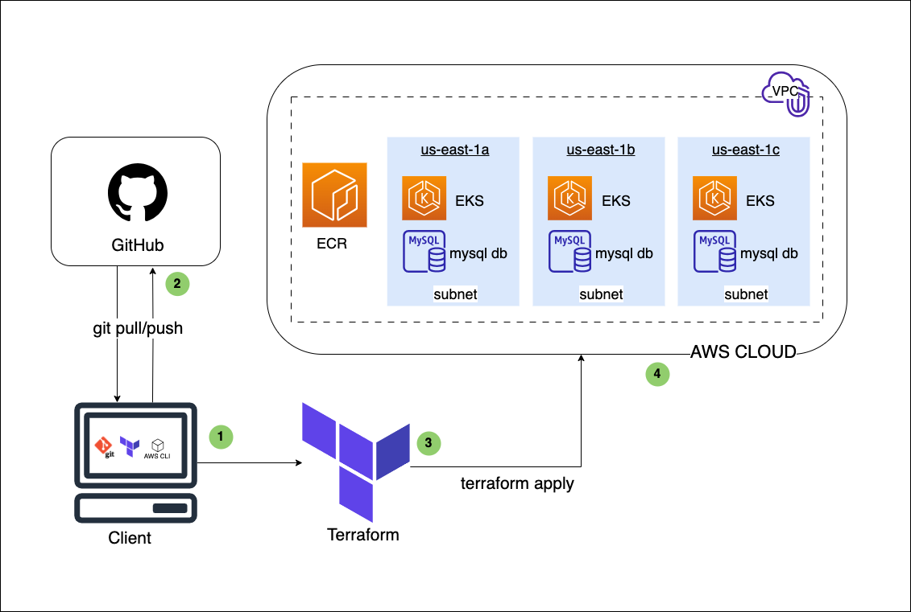

# DevOps Task

### Objectives:

To use infrastructure-as-code tools (Terraform):

1. Set up EKS cluster, VPC, subnets, and other required resources.
2. Set up a private Docker registry to store the application's Docker images.
3. Setup MySQL Database.

## Infrastructure Architecture Diagram

Figure 1: Infrastructure diagram of the setup


1. Client device used to prepare the infrastructure as code. It should have git, terraform and AWS CLI installed.
2. GitHub: Source Code Management GitHub used for code versioning. With `git pull`, and `git push`, files are kept in sync with the remote server.
3. Terraform: The infrastructure-as-code tool used to codify and provision the infrastructure on cloud.
4. AWS Cloud, where the infrastructure resources are provisioned.

## Solution Deployment

### Step 0: Getting Started

**Prerequisites:**
To reproduce this set-up:

- Familiarity with Linux, Git and GitHub, infrastructure-as-code and DevOps has been assumed.
- Ubuntu Linux 20.04 Focal Fossa LTS distribution was used for all the activities in the task.
- An AWS account with appropriate permissions to create resources like EKS, VPC, subnets, ECR, and RDS (MySQL) is required. Visit this link to [create an AWS account](https://docs.aws.amazon.com/accounts/latest/reference/manage-acct-creating.html) if you don't already have an account.

**Considerations:**

- Availability: For High availability and fault tolerance, instances have been replicated on different availability zones (us-east-1a, us-east-1b, us-east-1c) within the same region.
- Security: Principle of Least Privilege was considered when assigning policy to IAM role for the cluster.
- Security: Public access to the MySQL database has been disabled.

### Step 1: Confirm Terraform is Installed Locally

The command to install Terraform may be slightly different, depending on your local operating system. Refer to the terraform installation documentation for system-specific requirements: [https://developer.hashicorp.com/terraform/tutorials/aws-get-started/install-cli](https://developer.hashicorp.com/terraform/tutorials/aws-get-started/install-cli).
Below is a command to install Terraform classic on an Ubuntu Linux machine.

```bash
sudo apt update && sudo apt upgrade -y
sudo snap install terraform --classic
```

To confirm the version of Terraform installed, run the command: `terraform --version`. This command will print the version of terraform installed.

Figure 2: showing version of terraform installed


### Step 2: Install and Configure AWS CLI to Authenticate to AWS.

Download and install the AWS CLI based on your operating system. Refer to this AWS documentation for device/operating system specific instruction: [https://docs.aws.amazon.com/cli/latest/userguide/getting-started-install.html](https://docs.aws.amazon.com/cli/latest/userguide/getting-started-install.html).

Below is a command to install it on Linux, distribution.

```bash
curl "https://awscli.amazonaws.com/awscli-exe-linux-x86_64.zip" -o "awscliv2.zip"
unzip awscliv2.zip
sudo ./aws/install
```

To confirm the version of terraform installed, run the command: `aws --version`. This command will print the version of AWS CLI that is installed.

```bash
aws --version
```

Figure 3: showing version of aws-cli installed


Optionally, you can run this command to remove the installation files:

```bash
rm -r aws awscliv2.zip
```

**Set Up AWS Environment Variables**

Set up AWS environment variables to help Terraform automatically pick up your AWS credentials.

Get your access keys and secret keys from AWS: follow this documenation for the detailed steps: [https://docs.aws.amazon.com/powershell/latest/userguide/pstools-appendix-sign-up.html](https://docs.aws.amazon.com/powershell/latest/userguide/pstools-appendix-sign-up.html)
Run the command on your terminal: **`aws configure`**.

```bash
aws configure
```

Set the following environment variables with your AWS credentials:

- **`AWS_ACCESS_KEY_ID`**: <AWS_Access_Key_ID>
- **`AWS_SECRET_ACCESS_KEY`**: <AWS_Secret_Access_Key>
- **`AWS_DEFAULT_REGION`**: <Preferred_AWS_region (e.g., **`us-east-1`**)>
- **`Default output format`**: json

Run the following command to verify that your AWS CLI is configured correctly:

```bash
aws sts get-caller-identity
```

You should see information about the AWS account that your credentials are associated with.

### Step 3: Create your Terraform Configuration Files:

<details>
<summary>Option 1: Pull the repository from GitHub</summary>
<br>
  
Clone the Terraform repository from GitHub to your client device and change directory `cd` into this repository:
  
```bash
git clone https://github.com/paschalogu/Terraform.git
cd Terraform
```
</details>

<details>
<summary>Option 2: Create your own terraform configuration files</summary>
<br>
Make a Repository on your local device to hold Terraform codes, and change directory to this newly created repository.

```bash
mkdir Terraform && cd Terraform
```

The `mkdir` command creates the directory, and the `cd` command changes the working directory to the newly created "Terraform" directory.

Create `main.tf` for the main Terraform configuration, `variables.tf` to define variables (helpful for managing settings), and `outputs.tf` to define outputs (display useful information after running `terraform apply`).

```bash
touch main.tf variables.tf outputs.tf
```

The command above creates the three files at ones.

**Write your Terraform code in the Appropriate Files.**
Run the command `nano main.tf` and paste the code from [main.tf](main.tf) inside:
Repeat same steps for `variables.tf` and `outputs.tf` and paste the code from [variables.tf](variables.tf) and [outputs.tf](outputs.tf) respectively.

</details>
<br>
This is the structure of the directory after files have been created.

Figure 4: Showing the structure of the Terraform Directory


**Resources to be Created**:

1. Virtual Private Cloud (VPC): The Virtual Private Cloud will be created to isolates virtual networks within the aws cloud infrastructure, providing control over network settings, IP address ranges, and subnets securely.

2. Subnets: Three subnets will be created within 3 availability zones. This multi-AZ architecture is considered and designed to provide redundancy and high availability.

3. IAM Role: Identity and Access Management (IAM) role that has the necessary permissions for managing the cluster will be created. This IAM role will be used by the EKS cluster.

4. IAM Role Policy Attachment: A resource to attachment the AmazonEKSClusterPolicy to the IAM role created for the EKS cluster.

5. Elastic Kubernetes Service (EKS) cluster: AWS EKS cluster will be created and associated with the IAM role created above.

6. Elastic Container Registry (ECR): An Elastic Container Registry in which you to store Application Docker images will be created.

7. MySQL database Instance: An RDS MySQL instance with the specified configurations like identifier, engine, instance class, allocated storage, username, password, etc.

### Step 4: Initialize, Plan, and Apply Terraform Configuration in your Project Directory:

To initialize the terraform project, run the command:

```bash
terraform init
```

To review the list of changes that will be applied during creation, run the command below:

```bash
terraform plan
```

Apply Terraform configuration to create AWS resources:

```bash
terraform apply
```

Terraform will display the changes to be made to AWS cloud infrastructure. Type **`yes`** and press Enter to confirm and apply the changes. To see the state of the infrastructure, run the command below:

```bash
terraform state list
```

Figure 5: Showing the terraform state command


Alternatively, you can use AWS CLI or the AWS Management Console to verify that the resources were created as expected.

### Step 5: Pushing the code to GitHub

Create a new repository on GitHub and push the Terraform repository from the command line.

Initialize the repository for git to track changes in the repository.On your project directory, run the below command to initialize git:

```bash
git init
```

Create a `.gitignore` file by running the command `nano .gitignore`.
Input the files you don't want to commit to gitHub in this .gitignore file. This includes variable files and terraform state files. Any file added here will not be pushed to GitHub. Add below files to the .gitignore file:

```bash
.git/
.terraform/
*.tfvars
terraform.tfstate
terraform.tfstate.backup
.terraform.lock.hcl
variables.tf
```

Proceed to add, commit, and push the code to Github.

```bash
git add .
git commit -m "Commit Message"
git branch -M main
git remote add origin https://github.com/<github_username>/<github_repo>.git
git push -u origin main
```

### Step 6: Deletion of Resources

To destroy, delete and clean up everything, run the destroy command below and type `yes` when prompted:

```bash
terraform destroy
```
